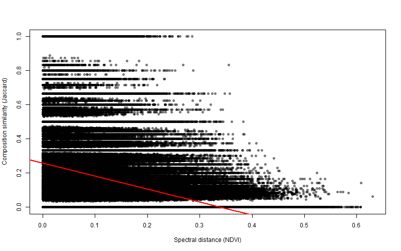
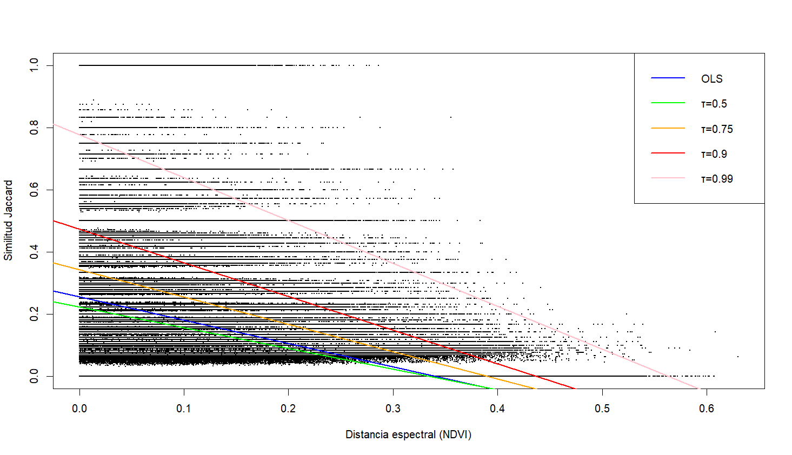
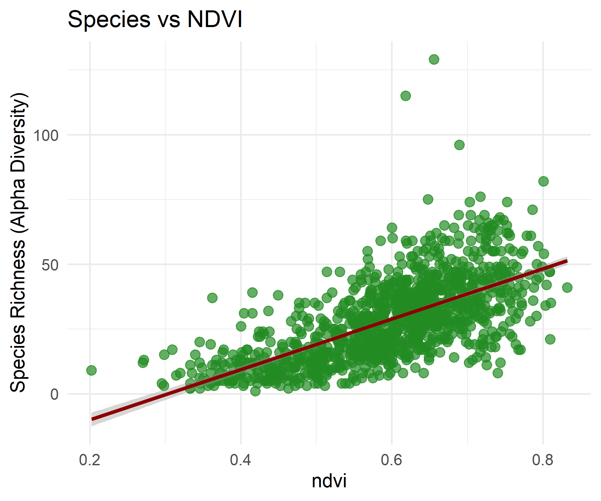
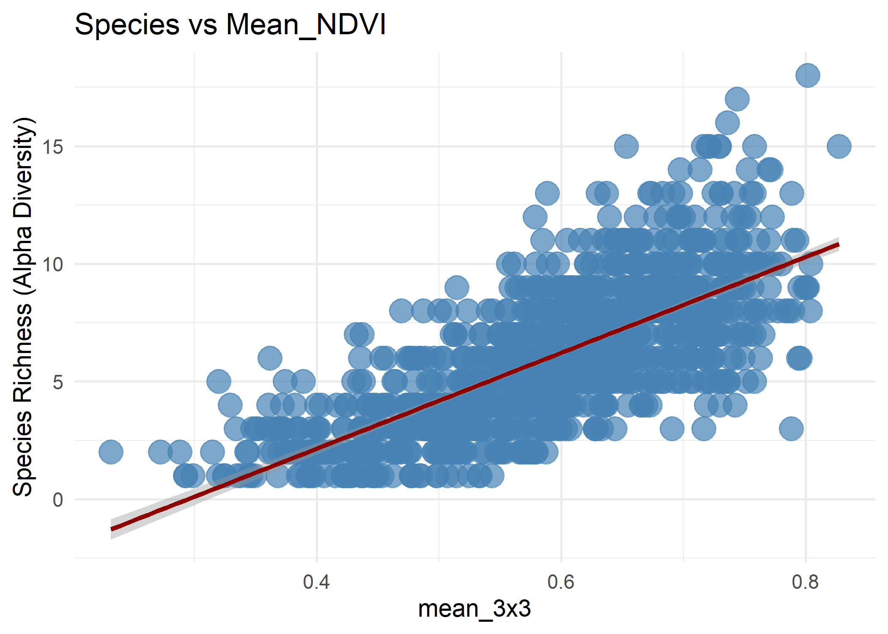
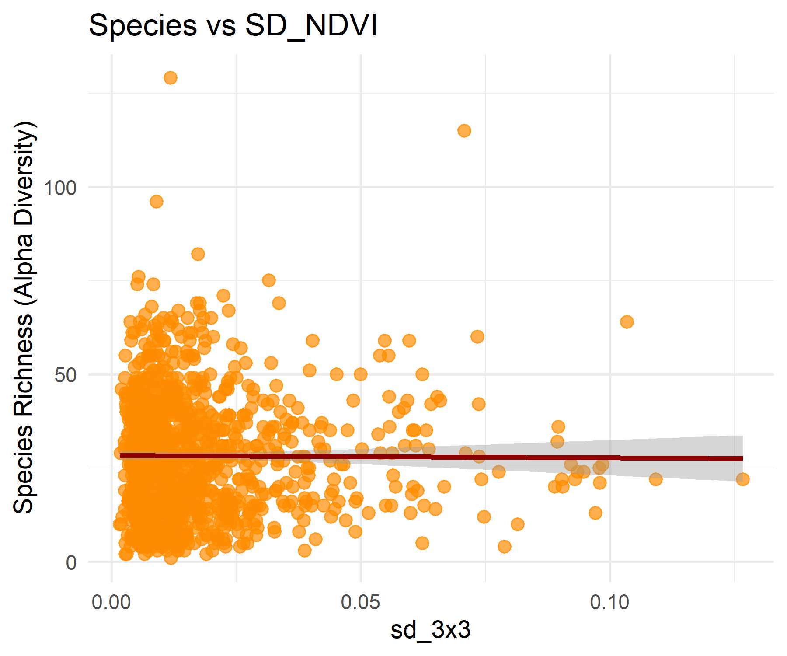
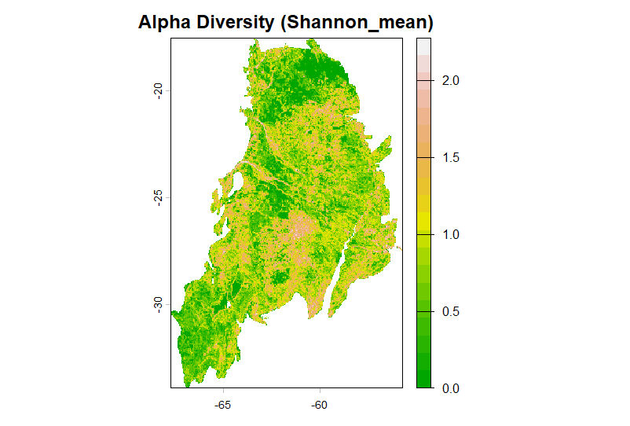
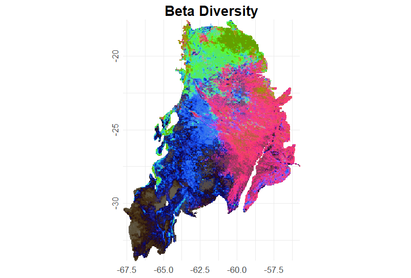
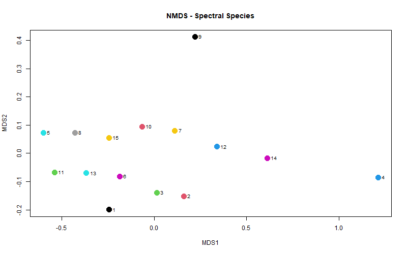

# 🌿 Diversity Patterns in the Gran Chaco Based on Satellite-Derived Metrics

## Overview

This repository analyzes the relationship between **spectral variability derived from satellite imagery** and **species composition similarity** across sampling plots in the **Gran Chaco**, one of the largest tropical dry forests in South America. The workflow combines **field biodiversity data** with **remote sensing information (MODIS NDVI)** to evaluate whether increasing spectral heterogeneity is associated with decreasing community similarity.

Two complementary analyses are implemented:

**`spectral_biodiversity_analysis()`**
- Compare **Jaccard community dissimilarity** with **spectral distance derived from NDVI**.
- Evaluate the relationship using **Mantel tests**, **OLS regression**, and **quantile regression**.
- Generate plots showing the relationship between species richness **(alpha diversity)** and NDVI metrics.

**`biodivMapR_full()`**
- Use the R package **biodivMapR** to compute spectral **α-diversity** (richness, Shannon, Simpson) and **β-diversity** from **NDVI time-series stacks**.
- Generate spatial maps of biodiversity patterns across the region.

---

## 📁 Repository Structure 

```
project/
│
├── 📁scripts/                     # Original analysis scripts
│   ├── 📄spectral_biodiversity_analysis.R
│   └── 📄biodivMapR.R
│
├── 📁Images/                     # Selected results from the full analysis
│   ├── 📄quantile_regression_plot.png
│   ├── 📄alpha_vs_*.png
│   ├── 📄alpha_diversity_map.png
│   └── 📄beta_diversity_map.png
│   
│
├── 📁example/                     # Minimal reproducible example with small datasets
│
└── 📄README.md
```
---

## 📊 Workflow

### 📦 Required packages
```r
install.packages(c("terra","vegan","quantreg","pkgbuild","remotes"))
remotes::install_github("cran/dissUtils")
remotes::install_github("jbferet/biodivMapR")
```
---

## 1️⃣ Spectral–Biodiversity Analysis ("spectral_biodiversity_analysis.R")
This function computes everything needed for alpha and beta diversity analyses:

🔹**Community dissimilarity (β-diversity):** Calculates Jaccard distances between sites.  0 → identical communities , 1 → no shared species

🔹**Spectral distance:** Extracts NDVI from MODIS and computes local variability (3×3 mean & SD) and Euclidean distances between plots.

🔹**Spectral–community relationship:** Evaluates how community similarity decreases with spectral distance using scatter plots, Mantel tests, and quantile regression (τ = 0.5, 0.75, 0.9, 0.99). Quantile regression allows analysis of the upper-bound decay of community similarity as spectral distance increases.

🔹**Spectral–species relationship (α-diversity):** Plots species richness vs NDVI metrics (mean, SD, and raw values).


### ▶️ Run 
```r
#Aplications
spectral_biodiversity_analysis(
  community_matrix_path = "./input_data/Community_matrix.csv",
  points_path = "./input_data/sampling_points.csv",
  raster_path = "./input_data/Modis_2025_anualmedian.tif",
  output_dir = "./out",
  mantel_test = TRUE,          # TRUE: perform Mantel test
  quantile_regression = TRUE,  # TRUE: perform OLS + quantile regression
  plot_alpha = TRUE,           # TRUE: generate alpha plots (NDVI, SD, Mean)
  
  # USER SETTINGS
  # Modify only if your column names are different
  id_column = "ID",
  lon_column = "long",
  lat_column = "lat",
  richness_column = "richness"
)

```

### 📝 Expected outputs

All outputs are saved in `out/`:

```
out/
 ├── 📄 distance_jaccard_matrix.csv        # Pairwise Jaccard distance matrix calculated from the community matrix
 ├── 📄 spectral_distance_matrix.csv       # Pairwise spectral distance matrix derived from NDVI values at sampling points
 ├── 📄 distance_relationship_plot.png     # Scatter plot showing the relationship between species and spectral distances
 ├── 📄 mantel_test_results.txt            # Results of the Mantel test evaluating the correlation between both distance matrices
 ├── 📄 quantile_regression_results.txt    # Output summary of the quantile regression analysis
 ├── 📄 quantile_regression_plot.png       # Plot of the quantile regression showing the upper-bound relationship between distances
 ├── 📄 alpha_vs_ndvi.png                  # Scatter plot of species richness (number of species per plot). vs. NDVI values at sampling points
 ├── 📄 alpha_vs_mean_3x3.png              # Scatter plot of species richness (number of species per plot). vs. local 3x3 mean NDVI
 └── 📄 alpha_vs_sd_3x3.png                # Scatter plot of species richness (number of species per plot). vs. local 3x3 NDVI standard deviation
```

### 📝 Visualization of results

### β-Diversity → Spectral Similarity
The first plot shows the relationship between spectral distance and species composition similarity between plots.
The second plot displays the quantile regressions (50th, 75th, 90th, and 99th percentiles) together with the OLS regression line.
<p align="center">


</p>


### α-Diversity → Richness vs NDVI
These three plots show the relationship between species richness and different NDVI-based spectral metrics. Specifically, they present the relationship between species richness and (i) the NDVI values extracted at the sampling points, (ii) the mean NDVI calculated within a 3×3 moving window, and (iii) the standard deviation of NDVI calculated within a 3×3 moving window.

<p align="center">
    
    
    
</p>


---

## 2️⃣ Biodiversity Mapping with `biodivMapR_full()` ("BiodivMapR.R")

This script will:

1. Check R build tools (R 4.5 compatible)  
2. Install `biodivMapR` and dependencies (`terra`, `dissUtils`)  
3. Split NDVI stack into single-band rasters  
4. Create an “all valid” mask  
5. Run `biodivMapR_full()` to calculate alpha and beta diversity metrics  
6. Perform K-means clustering and NMDS ordination on spectral centroids

### ⚙️ Main parameters

- `window_size = 10` → size of the moving window for diversity calculations  
- `alpha_metrics = c("richness","shannon","simpson")`  
- `nb_clusters = 20` → number of clusters for K-means  
- `maxRows = 1e6` → memory management  
- `progressbar = TRUE` → shows computation progress

### ▶️ Run 

```r
ab_info_NDVI <- biodivMapR_full(
  input_raster_path = ndvi_list,
  input_mask_path   = mask_path_all,
  output_dir        = output_dir,
  window_size       = window_size,
  Kmeans_info_save  = Kmeans_info_save,
  Beta_info_save    = Beta_info_save,
  options           = opts
)
```

### 📝 Visualization of results
```r
# Load rasters
shannon_raster <- rast(file.path(output_dir, "shannon_mean.tiff"))
beta_raster    <- rast(file.path(output_dir, "Beta.tiff"))  # must have 3 bands for RGB
```

### Alpha-Diversity
```r
# Plot Alpha - Shannon
plot(shannon_raster,
     main = "Alpha Diversity (Shannon_mean)",
     col = terrain.colors(20))  # you can change the palette
```
<p align="center">
  
</p

### <h3>Beta-Diversity</h3>
```r
# Plot Beta diversity
# Convert SpatRaster to data frame
df <- as.data.frame(beta_raster, xy = TRUE)
colnames(df) <- c("x","y","R","G","B")

# Normalize values between 0 and 1
df$R <- (df$R - min(df$R, na.rm=TRUE)) / (max(df$R, na.rm=TRUE) - min(df$R, na.rm=TRUE))
df$G <- (df$G - min(df$G, na.rm=TRUE)) / (max(df$G, na.rm=TRUE) - min(df$G, na.rm=TRUE))
df$B <- (df$B - min(df$B, na.rm=TRUE)) / (max(df$B, na.rm=TRUE) - min(df$B, na.rm=TRUE))

# Create hexadecimal color
df$color <- rgb(df$R, df$G, df$B)

# Plot with ggplot
ggplot(df, aes(x = x, y = y, fill = color)) +
  geom_raster() +
  scale_fill_identity() +
  coord_equal() +
  labs(title = "Beta Diversity") +   
  scale_y_continuous(expand = c(0,0)) +
  scale_x_continuous(expand = c(0,0)) +
  theme_minimal() +
  theme(
    plot.title = element_text(
      size = 16, 
      hjust = 0.5, 
      face = "bold",
      margin = margin(b = 2)    
    ),
    axis.title = element_blank(),     # no axis labels
    axis.text.x = element_text(size = 10, angle = 0, vjust = 0.5),      
    axis.text.y = element_text(size = 10, angle = 90, hjust = 0.5)     
  )
```
<p align="center">
  
</p


### ▶️ Run K-means clustering
```r
# Load Kmeans_info file
load(Kmeans_info_save)
centroids <- Kmeans_info$Centroids[[1]]   # first iteration


# Perform NMDS on centroids
nmds <- metaMDS(centroids, distance = "euclidean", k = 2)

# Save NMDS plot as PNG
png(filename = "./out/biodivMapR/nmds_plot.png", width = 800, height = 500)
plot(nmds$points,
     col = 1:nrow(centroids),
     pch = 19,
     cex = 2,
     main = "NMDS - Spectral Species")
text(nmds$points,
     labels = 1:nrow(centroids),
     pos = 4,
     cex = 0.8)
dev.off()
```

### 📝 Visualization of results
```
load(Kmeans_info_save)

pts <- metaMDS(Kmeans_info$Centroids[[1]],
               distance = "euclidean", k = 2, trace = 0)$points

plot(pts,
     pch = 19,
     col = 1:nrow(pts),
     asp = 1,
     main = "NMDS - Spectral Species")

text(pts, labels = 1:nrow(pts), pos = 4, cex = 0.7)
```

<p align="center">
  
</p

The NMDS plot displays the spectral species centroids obtained from the K-means clustering (k=15), allowing visualization of the spectral relationships among clusters in a two-dimensional space.


### 📝 Expected outputs

All outputs are saved in `outputs/`:

```
out/BiodivMapR
 ├── 📄 NDVI_band_*.tif        # Individual raster bands
 ├── 📄 mask_all.tif           # Mask used for analysis
 ├── 📄 Kmeans_info.RData      # Centroids and clustering info
 ├── 📄 Beta_info.RData        # Beta diversity results
 ├── 📄 nmds_plot.png          # NMDS of spectral species centroids (generated in R)
 ├── 📄 Beta                   # Beta diversity raster outputs
 ├── 📄 Shannon_*              # Shannon diversity raster outputs (two rasters: mean and standard deviation)
 ├── 📄 Simpson_*              # Simpson diversity raster outputs (two rasters: mean and standard deviation)
 └── 📄 richness_*             # Spectral richness raster outputs (two rasters: mean and standard deviation)
 ```


## 📚 Reference

Féret, J.-B., de Boissieu, F., 2019. biodivMapR: an R package for α‐ and β‐diversity mapping using remotely‐sensed images. Methods Ecol. Evol. 00:1-7. https://doi.org/10.1111/2041-210X.13310

Féret, J.-B., Asner, G.P., 2014. Mapping tropical forest canopy diversity using high-fidelity imaging spectroscopy. Ecol. Appl. 24, 1289–1296. https://doi.org/10.1890/13-1824.1

Gillespie, T. W. (2005). Predicting woody‐plant species richness in tropical dry forests: a case study from south Florida, USA. Ecological Applications, 15(1), 27-37. https://doi.org/10.1890/03-5304

Rocchini D. and Cade B. S., "Quantile Regression Applied to Spectral Distance Decay," in IEEE Geoscience and Remote Sensing Letters, vol. 5, no. 4, pp. 640-643, Oct. 2008, [doi: 10.1109/LGRS.2008.2001767.](https://ieeexplore.ieee.org/document/4656450)
