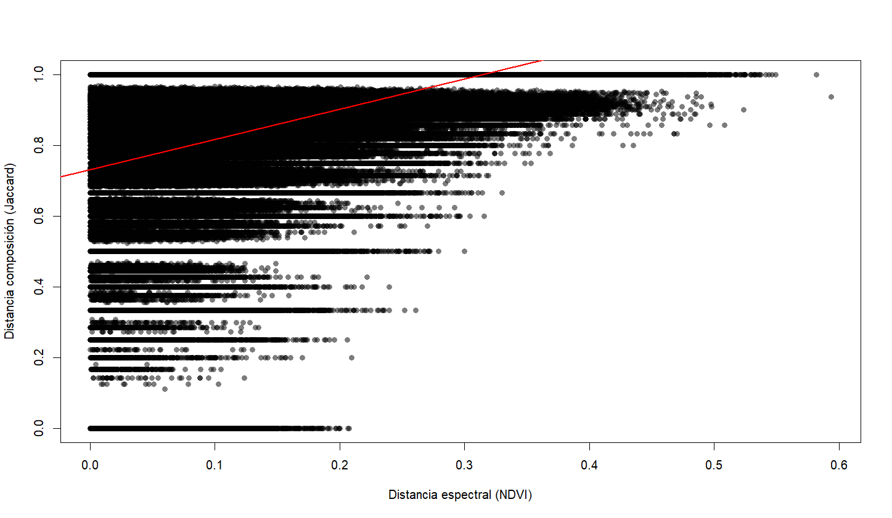
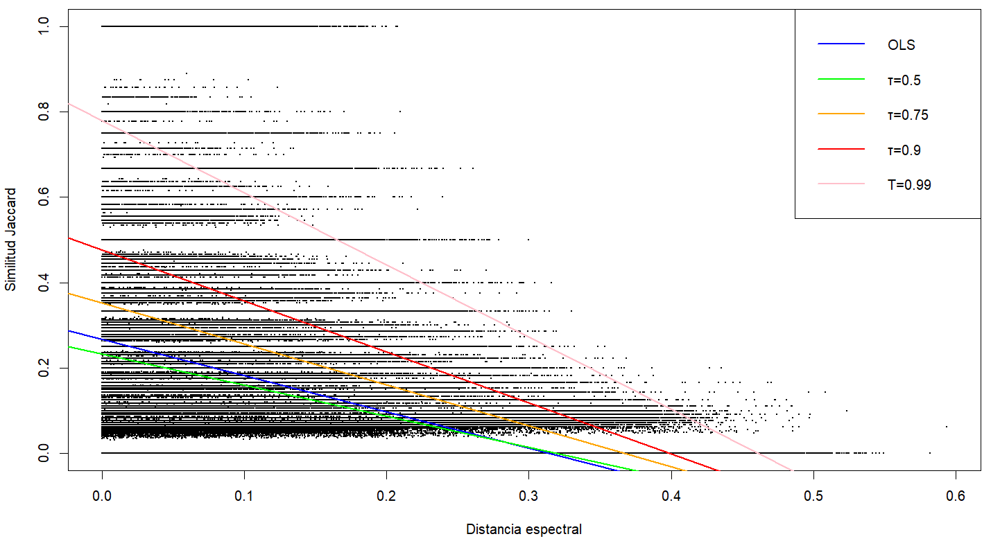
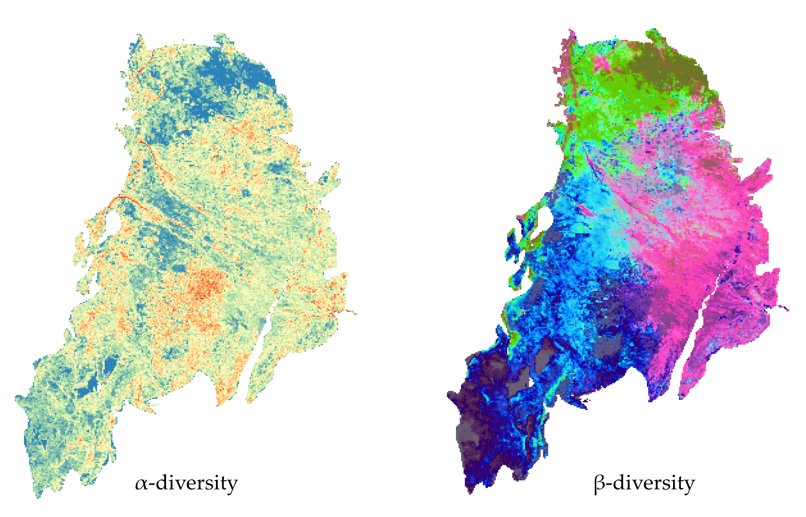
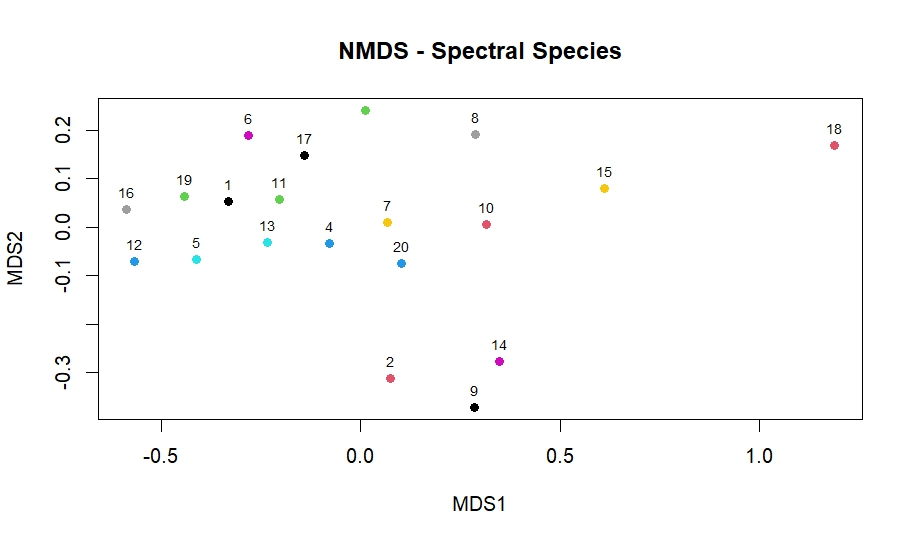

# Spectral Distance and Species Similarity in the Gran Chaco

## Project Description
This repository analyzes the relationship between spectral distance and species similarity across plots in the Gran Chaco. We test whether increasing spectral variability is associated with decreasing community similarity using the Jaccard index and quantile regression (95% and 99% upper quantiles). Species similarity was compared with spectral distance derived from MODIS. 

The `biodivMapR` package was then used to estimate spectral alpha (α) and beta (β) diversity across the region using cluster-based approaches (10–50 clusters), generating spatial maps of diversity and turnover.

This workflow links remote sensing–derived spectral variability with community dissimilarity and regional diversity patterns, providing a reproducible framework for ecological analysis in dry forests.

---
## Methods

### 1. Calculation of Jaccard distance
```r
library(vegan)

# Load community matrix
community_matrix <- read.csv("data/Community_matrix.csv")

# Set ID column as row names and remove it from data
rownames(community_matrix) <- community_matrix$ID
species_only_matrix <- community_matrix[ , -which(names(community_matrix) == "ID")]

# Calculate Jaccard distance
dist_jaccard <- vegdist(species_only_matrix, method = "jaccard")

# Convert to full matrix to inspect
dist_jaccard_matrix <- as.matrix(dist_jaccard)
head(dist_jaccard_matrix [, 1:4]) # ver primeras filas y columnas
```
**Community Dissimilarity Matrix (Jaccard, excerpt)**

Pairwise Jaccard dissimilarity matrix based on species presence–absence.
Values range from 0 (identical composition) to 1 (no shared species).
The matrix is symmetric with a zero diagonal.

| Plot ID | 10049073 | 10050081 | 10052080 | 10053077 |
|--------:|---------:|---------:|---------:|---------:|
| **10049073** | 0.0000 | 0.6667 | 0.9167 | 0.8182 |
| **10050081** | 0.6667 | 0.0000 | 1.0000 | 1.0000 |
| **10052080** | 0.9167 | 1.0000 | 0.0000 | 0.6000 |
| **10053077** | 0.8182 | 1.0000 | 0.6000 | 0.0000 |
| **10053083** | 0.6667 | 0.6667 | 1.0000 | 1.0000 |


---
### 2. Extraction of NDVI values and calculation of spectral distance
```r
library(terra)
library(readxl)
library(dplyr)

# Load NDVI raster
ndvi_raster <- rast("date/MODIS_2025_NDVI_ANUAL.tif")

# Load field points
points <- read.csv("date/points.csv")

# Convert to SpatVector
points_vect <- vect(points, geom = c("long", "lat"), crs = crs(ndvi_raster))

# Compute 3x3 focal mean and SD
ndvi_mean3x3 <- focal(ndvi_raster, w = 3, fun = mean, na.rm = TRUE)
ndvi_sd3x3   <- focal(ndvi_raster, w = 3, fun = sd, na.rm = TRUE)

# Extract values for each point
ndvi_original_vals <- extract(ndvi_raster, points_vect)
ndvi_mean_vals     <- extract(ndvi_mean3x3, points_vect)
ndvi_sd_vals       <- extract(ndvi_sd3x3, points_vect)

# Combine with point ID
ndvi_points <- cbind(
  ID = points$ID,
  ndvi = ndvi_original_vals[,-1],
  mean_3x3 = ndvi_mean_vals[,-1],
  sd_3x3   = ndvi_sd_vals[,-1]
)


# Build spectral distance matrix
ndvi_matrix <- ndvi_points[, "ndvi", drop = FALSE] # Select ndvi or (mean, sd) column for distance calculation
row.names(ndvi_matrix) <- ndvi_points[, "ID"]

# Calculate Euclidean distance
ndvi_dist <- dist(ndvi_matrix, method = "euclidean")
ndvi_dist_matrix <- as.matrix(ndvi_dist)

head(ndvi_dist_matrix[, 1:4])   
```
**Spectral Distance Matrix (NDVI, excerpt)**

Pairwise spectral distance matrix derived from NDVI spatial variability (3×3 SD)
between sampling plots. The matrix is symmetric with a zero diagonal.

| Plot ID | 10049073 | 10050081 | 10052080 | 10053077 |
|--------:|---------:|---------:|---------:|---------:|
| **10049073** | 0.0000 | 0.0478 | 0.1850 | 0.1611 |
| **10050081** | 0.0478 | 0.0000 | 0.2328 | 0.2089 |
| **10052080** | 0.1850 | 0.2328 | 0.0000 | 0.0239 |
| **10053077** | 0.1611 | 0.2089 | 0.0239 | 0.0000 |
| **10053083** | 0.0159 | 0.0319 | 0.2009 | 0.1770 |


---
### 3. Spectral–Community Relationship Analysis
```r
library(vegan)

# Load distance matrices
dist_species <- read.csv("data/distance_jaccard_MODIS.csv", row.names = 1)
dist_ndvi <- read.csv2("data/NDVIx3_distance_MODIS.csv", row.names = 1)

# Convert to matrices
D_biodiv    <- as.matrix(dist_species)
D_espectral <- as.matrix(dist_ndvi)

# Convert the entire matrix to numeric vectors
y_species  <- as.numeric(D_biodiv)
x_spectral <- as.numeric(D_espectral)

# Quick exploratory plot
plot(x_spectral, y_species,
     xlab = "Spectral distance (NDVI)",
     ylab = "Composition distance (Jaccard)",
     pch = 16, col = rgb(0,0,0,0.3))

abline(lm(y_species ~ x_spectral), col="red", lwd=2)
```


### Compare matrices using Mantel test
```r
mantel_result <- mantel(D_biodiv, D_espectral, method = "pearson", permutations = 999)
print(mantel_result)
```

**Mantel Test Summary (Pearson)**

| Metric | Value |
|------|------|
| Correlation method | Pearson |
| Mantel statistic (r) | **0.4359** |
| p-value | **0.001** |
| Permutations | 999 |
| Permutation type | Free |


### OLS and Quantile Regression Analysis
```r
library(quantreg)

# Extract upper triangle for regression (avoid duplicates)
dist_spec_vec <- as.vector(D_espectral[upper.tri(D_espectral)])
dist_bio_vec  <- as.vector(D_biodiv[upper.tri(D_biodiv)])

# Create clean data frame
df <- data.frame(dist_spec = dist_spec_vec,
                 dist_bio  = dist_bio_vec)
df <- na.omit(df)

# Convert distance to similarity
df$sim_bio <- 1 - df$dist_bio


# Ordinary Least Squares (OLS)
lm_model <- lm(sim_bio ~ dist_spec, data = df)

# Quantile regressions
rq_50 <- rq(sim_bio ~ dist_spec, tau = 0.5, data = df)
rq_75 <- rq(sim_bio ~ dist_spec, tau = 0.75, data = df)
rq_90 <- rq(sim_bio ~ dist_spec, tau = 0.9, data = df)
rq_99 <- rq(sim_bio ~ dist_spec, tau = 0.99, data = df)

summary(lm_model)
summary(rq_50)
summary(rq_75)
summary(rq_90)
summary(rq_99)
```

**Linear Model (OLS)**

Relationship between spectral distance and community similarity.

| Term | Estimate | Std. Error | t value | p-value |
|----|----:|----:|----:|----:|
| Intercept | 0.2562 | 0.0003 | 888.2 | < 2e-16 |
| Spectral distance | **-0.7502** | 0.0019 | -393.0 | < 2e-16 |

**Quantile Regression Results**

Estimated effects of spectral distance on community similarity across upper quantiles.

| Quantile (τ) | Intercept | Spectral distance | Std. Error | p-value |
|----:|----:|----:|----:|----:|
| 0.50 | 0.2225 | -0.6650 | 0.0014 | < 0.001 |
| 0.75 | 0.3436 | -0.8799 | 0.0022 | < 0.001 |
| 0.90 | 0.4728 | -1.0822 | 0.0024 | < 0.001 |
| 0.99 | 0.7768 | **-1.1928** | 0.0026 | < 0.001 |

Spectral distance shows a strong negative effect on community similarity across all quantiles.
The magnitude of the effect increases toward upper quantiles, indicating a stronger decay in
maximum similarity as spectral heterogeneity increases.

### Final plot with all regression lines
```r
plot(df$dist_spec, df$sim_bio,
     pch = 16, cex = 0.2,
     xlab = "Spectral distance (NDVI)",
     ylab = "Jaccard similarity")

abline(lm_model, col = "blue", lwd = 2)
abline(rq_50, col = "green", lwd = 2)
abline(rq_75, col = "orange", lwd = 2)
abline(rq_90, col = "red", lwd = 2)
abline(rq_99, col = "pink", lwd = 2)

legend("topright",
       legend = c("OLS", "τ=0.5", "τ=0.75", "τ=0.9","τ=0.99"),
       col = c("blue", "green", "orange", "red","pink"),
       lwd = 2)
```




---
### 4. Alpha and Beta Spectral Diversity

In this analysis, we used the R package biodivMapR for α- and β-diversity mapping from MODIS images. 
This package allows the estimation of spectral diversity metrics (richness, Shannon, Simpson) and the assessment of spatial patterns of alpha and beta diversity from raster stacks (e.g., NDVI). It is particularly useful for evaluating landscape heterogeneity and monitoring vegetation or ecosystem changes.


Féret, J.-B., de Boissieu, F., 2019. biodivMapR: an R package for α‐ and β‐diversity mapping using remotely‐sensed images. Methods Ecol. Evol. 00:1-7. https://doi.org/10.1111/2041-210X.13310

Féret, J.-B., Asner, G.P., 2014. Mapping tropical forest canopy diversity using high-fidelity imaging spectroscopy. Ecol. Appl. 24, 1289–1296. https://doi.org/10.1890/13-1824.1


```r
# Load libraries
library(terra)       
library(biodivMapR)  

# Define file paths
ndvi_stack_path <- "date/MODIS_2025_NDVI_STACK_MONTHLY.tif"
# Optional vegetation mask
# mask_path <- "date/vegetation_mask.tif"
output_dir <- "date/biodivMapR"
dir.create(output_dir, showWarnings = FALSE, recursive = TRUE)


# Read NDVI stack and split into single-band rasters
ndvi_stack <- rast(ndvi_stack_path)
ndvi_list <- lapply(1:nlyr(ndvi_stack), function(i){
  band_path <- file.path(output_dir, paste0("NDVI_band_", i, ".tif"))
  writeRaster(ndvi_stack[[i]], band_path, overwrite = TRUE)
  return(band_path)
})


# Create "all valid" mask
mask_all <- ndvi_stack[[1]]  # use first band as template
mask_all[] <- 1              # set all pixels as valid
mask_path_all <- file.path(output_dir, "mask_all.tif")
writeRaster(mask_all, mask_path_all, overwrite = TRUE)

# Define intermediate files
Kmeans_info_save <- file.path(output_dir,'Kmeans_info.RData')
Beta_info_save   <- file.path(output_dir,'Beta_info.RData')

# Run biodivMapR_full
window_size <- 10  # window size for diversity calculation
opts <- list(
  alpha_metrics    = c("richness","shannon","simpson"), # alpha diversity metrics
  Hill_order       = 1,
  nb_samples_alpha = NULL,                 # Number of pixels sampled to compute alpha diversity (across the whole image)
  nb_samples_beta  = NULL,                 # Number of pixels sampled to compute beta diversity (across the whole image)
  fd_metrics       = NULL,                 # functional diversity (NULL = not used)
  nb_clusters      = 20,                   # number of clusters
  nb_iter          = 3,                    # number of iterations
  pcelim           = 0.02,                 # percentile elimination
  maxRows          = 1e6,                  # Maximum number of pixels used to train K-means clustering (memory management)
  min_sun          = 0.0,                  # Minimum solar illumination threshold (0 = no filtering)
  progressbar      = TRUE                  # Show progress bar during computation
)

ab_info_NDVI <- biodivMapR_full(
  input_raster_path = ndvi_list,
  input_mask_path   = mask_path_all,
  output_dir        = output_dir,
  window_size       = window_size,
  Kmeans_info_save  = Kmeans_info_save,
  Beta_info_save    = Beta_info_save,
  options           = opts
)
```
**alpha and beta diversity map**




### Plot centroids from K-means clustering
```r
# Load Kmeans_info file
load(Kmeans_info_save)
centroids <- Kmeans_info$Centroids[[1]]   # first iteration

library(vegan)
# Perform NMDS on centroids
nmds <- metaMDS(centroids, distance = "euclidean", k = 2)

# Plot NMDS
plot(nmds$points,
     col = 1:nrow(centroids),
     pch = 19,
     main = "NMDS - Spectral Species")

# Add labels to points
text(nmds$points,
     labels = 1:nrow(centroids),
     pos = 3,
     cex = 0.7)
```



