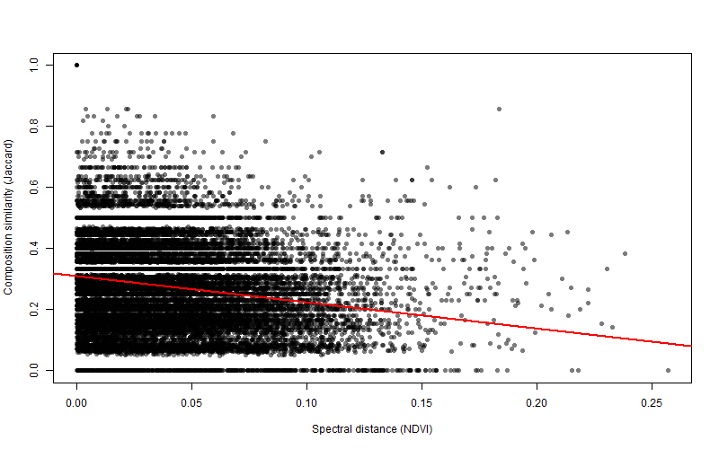
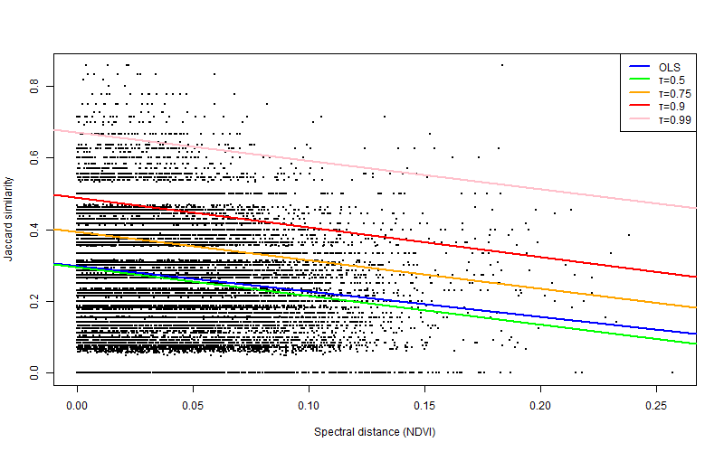
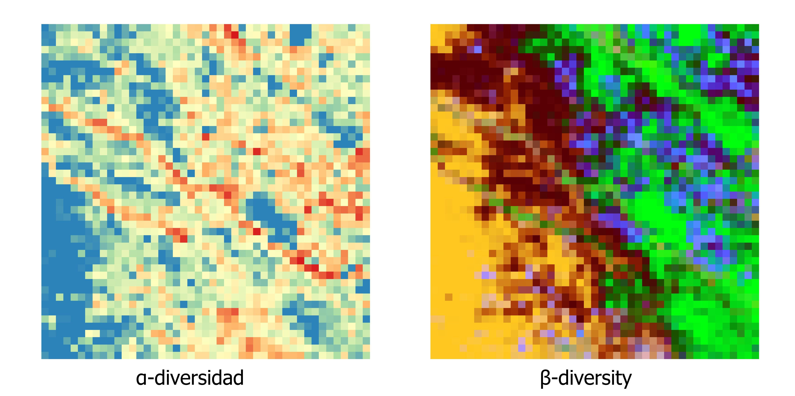
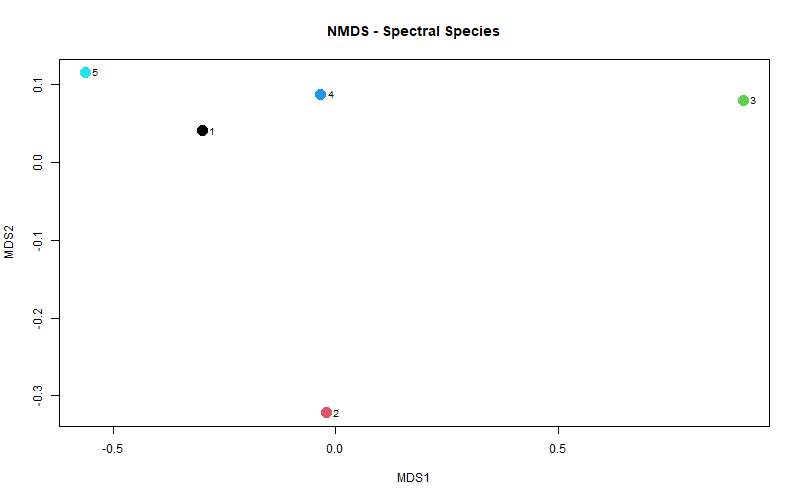

# 🌿 Reproducible Examples: Spectral–Biodiversity Analysis & biodivMapR

This folder contains two minimal reproducible examples for R-based spectral-biodiversity analyses:

1. **`spectral_diversity_analysis()`** – evaluates the relationship between species compositional similarity (Jaccard) and spectral distance derived from NDVI.  
2. **`biodivMapR_full()`** – calculates alpha and beta diversity metrics from NDVI raster stacks using clustering and window-based approaches.

---

## 📁 Contents

```
examples/
 ├── 📁 input_data/
     ├── 📄 Community_matrix.csv                  # Community matrix: sites in rows, species in columns, presence/absence values.   
     ├── 📄 points.csv                            # Required columns: ID, LONGITUD_I, LATITUD_IN.
     ├── 📄 Modis_2025_anualmedian.tif            # Annual NDVI raster required to compute spectral distances among sampling sites.
     └── 📄 stack_ndvi_2025.tif                   # Monthly NDVI raster stack (12 bands, one per month) representing the annual NDVI time series.
 ├── 📄 run_spectral_diversity_analysis.R         # Script for spectral_biodiversity_analysis
 ├── 📄 run_biodivMapR.R                          # Script for biodivMapR_full
 └── 📁 out/
```

---

## 1️⃣ Spectral–Biodiversity Analysis ("run_spectral_biodiversity_analysis.R")

### ⚙️ Function
```r
#--------------------------------------------------------
# Install required packages
#install.packages(c("vegan", "terra", "quantreg","rstudioapi"))
#--------------------------------------------------------

library(vegan)
library(terra)
library(quantreg)

setwd(dirname(rstudioapi::getActiveDocumentContext()$path)) #set actual wd


spectral_biodiversity_analysis <- function(
    community_matrix_path ,
    points_path,
    raster_path,
    output_dir = "out"
){
  
  dir.create(output_dir, showWarnings = FALSE)
  
  #--------------------------------------------------
  # 1. COMMUNITY MATRIX → JACCARD DISTANCE
  #--------------------------------------------------
  
  community_matrix <- read.csv(community_matrix_path)
  
  rownames(community_matrix) <- community_matrix$ID
  species_only_matrix <- community_matrix[ , -which(names(community_matrix) == "ID")]
  
  dist_jaccard <- vegdist(species_only_matrix, method = "jaccard")
  dist_jaccard_matrix <- as.matrix(dist_jaccard)
  
  write.csv(
    dist_jaccard_matrix, file.path(output_dir, "distance_jaccard_matrix.csv"), row.names = TRUE)
  
  
  #--------------------------------------------------
  # 2. SPECTRAL DISTANCE FROM RASTER
  #--------------------------------------------------
  
  ndvi_raster <- rast(raster_path)
  ndvi_raster <- ndvi_raster[["NDVI"]]
  
  points <- read.csv(points_path)
  
  points_vect <- vect(
    points,
    geom = c("LONGITUD_I", "LATITUD_IN"),
    crs = crs(ndvi_raster)
  )
  
  # 3x3 focal statistics
  ndvi_mean3x3 <- focal(ndvi_raster, w = 3, fun = mean, na.rm = TRUE)
  ndvi_sd3x3   <- focal(ndvi_raster, w = 3, fun = sd, na.rm = TRUE)
  
  # Extract values
  ndvi_original_vals <- extract(ndvi_raster, points_vect)
  ndvi_mean_vals     <- extract(ndvi_mean3x3, points_vect)
  ndvi_sd_vals       <- extract(ndvi_sd3x3, points_vect)
  
  ndvi_points <- cbind(
    ID = points$ID,
    ndvi = ndvi_original_vals[,-1],
    mean_3x3 = ndvi_mean_vals[,-1],
    sd_3x3   = ndvi_sd_vals[,-1]
  )
  
  ndvi_matrix <- ndvi_points[, "ndvi", drop = FALSE]
  row.names(ndvi_matrix) <- ndvi_points[, "ID"]
  
  ndvi_dist <- dist(ndvi_matrix, method = "euclidean")
  ndvi_dist_matrix <- as.matrix(ndvi_dist)
  

  write.csv2(
    ndvi_dist_matrix, file.path(output_dir, "spectral_distance_matrix.csv"), row.names = TRUE)
  
  
  #--------------------------------------------------
  # 3. DISTANCE RELATIONSHIP ANALYSIS
  #--------------------------------------------------
  
  D_biodiv    <- dist_jaccard_matrix
  D_espectral <- ndvi_dist_matrix
  
  S_biodiv <- 1 - D_biodiv
  
  y_species  <- as.numeric(S_biodiv)
  x_spectral <- as.numeric(D_espectral)
  
  
  # Exploratory plot
  png(file.path(output_dir,"distance_relationship_plot.png"), width=800,height=500)
  
  plot(x_spectral, y_species,
       xlab = "Spectral distance (NDVI)",
       ylab = "Composition similarity (Jaccard)",
       pch = 16, col = rgb(0,0,0,0.3))
  
  abline(lm(y_species ~ x_spectral), col="red", lwd=2)
  
  dev.off()
  
  
  #--------------------------------------------------
  # 4. MANTEL TEST
  #--------------------------------------------------
  
  mantel_result <- mantel(D_biodiv, D_espectral,
                          method = "pearson",
                          permutations = 999)
  
  capture.output(
    mantel_result, file = file.path(output_dir,"mantel_test_results.txt"))
  
  
  
  #--------------------------------------------------
  # 5. OLS + QUANTILE REGRESSION
  #--------------------------------------------------
  
  dist_spec_vec <- as.vector(D_espectral[upper.tri(D_espectral)])
  dist_bio_vec  <- as.vector(D_biodiv[upper.tri(D_biodiv)])
  
  df <- data.frame(
    dist_spec = dist_spec_vec,
    dist_bio  = dist_bio_vec
  )
  
  df <- na.omit(df)
  df$sim_bio <- 1 - df$dist_bio
  
  
  lm_model <- lm(sim_bio ~ dist_spec, data = df)
  
  rq_50 <- rq(sim_bio ~ dist_spec, tau = 0.5, data = df)
  rq_75 <- rq(sim_bio ~ dist_spec, tau = 0.75, data = df)
  rq_90 <- rq(sim_bio ~ dist_spec, tau = 0.9, data = df)
  rq_99 <- rq(sim_bio ~ dist_spec, tau = 0.99, data = df)
  
  
  capture.output(
    summary(lm_model),
    summary(rq_50),
    summary(rq_75),
    summary(rq_90),
    summary(rq_99),
    file = file.path(output_dir,"quantile_regression_results.txt")
  )

  #--------------------------------------------------
  # 6. FINAL PLOT
  #--------------------------------------------------
  
  png(file.path(output_dir,"quantile_regression_plot.png"),
      width=800,height=500)
  
  plot(df$dist_spec, df$sim_bio,
       pch = 16, cex = 0.3,
       xlab = "Spectral distance (NDVI)",
       ylab = "Jaccard similarity")
  
  abline(lm_model, col = "blue", lwd = 2)
  abline(rq_50, col = "green", lwd = 2)
  abline(rq_75, col = "orange", lwd = 2)
  abline(rq_90, col = "red", lwd = 2)
  abline(rq_99, col = "pink", lwd = 2)
  
  legend("topright",
         legend = c("OLS", "τ=0.5", "τ=0.75", "τ=0.9","τ=0.99"),
         col = c("blue", "green", "orange", "red","pink"),
         lwd = 2)
  
  dev.off()
  
  return("Analysis completed. Outputs saved in output_dir.")
}
```


### ▶️ Run the example

```r
spectral_biodiversity_analysis(
  community_matrix_path = "./input_data/Community_matrix.csv",
  points_path = "./input_data/points.csv",
  raster_path = "./input_data/Modis_2025_anualmedian.tif",
  output_dir = "./out"
)

```


### 📝 Expected outputs

All outputs are saved in `out/`:

```
out/
 ├── 📄 distance_jaccard_matrix.csv        # Pairwise Jaccard distance matrix calculated from the community matrix
 ├── 📄 spectral_distance_matrix.csv       # Pairwise spectral distance matrix derived from NDVI values at sampling points
 ├── 📄 distance_relationship_plot.png     # Scatter plot showing the relationship between species and spectral distances
 ├── 📄 mantel_test_results.txt            # Results of the Mantel test evaluating the correlation between both distance matrices
 ├── 📄 quantile_regression_results.txt    # Output summary of the quantile regression analysis
 └── 📄 quantile_regression_plot.png       # Plot of the quantile regression showing the upper-bound relationship between distances
```

### 📝 Visualization of results

The first plot shows the relationship between spectral distance and species composition similarity between plots.  
The second plot displays the quantile regressions (50th, 75th, 90th, and 99th percentiles) together with the OLS regression line.

<p align="center">
  
  
</p>

---

## 2️⃣ Biodiversity Mapping with `biodivMapR_full()` ("run_BiodivMapR.R")

### ⚙️ Function
```r
##----------------------------------------------------------
## necessary libreries
## Download tools compatible with R 4.5
# Check that the system finds the required paths
#Sys.which("make")
#Sys.which("gcc")

## This confirms that R can compile packages from source.
#install.packages("pkgbuild")
#pkgbuild::check_build_tools(debug = TRUE)

# Installation
#install.packages("remotes")
#remotes::install_github("cran/dissUtils")
#remotes::install_github("jbferet/biodivMapR")
##----------------------------------------------------------

# Load libraries
library(terra)       
library(biodivMapR)  

setwd(dirname(rstudioapi::getActiveDocumentContext()$path)) #set actual wd

# Define file paths
ndvi_stack_path <- "./input_data/stack_ndvi_2025.tif"
# Optional vegetation mask
# mask_path <- "~/vegetation_mask.tif"
output_dir <- "./out/biodivMapR"
dir.create(output_dir, showWarnings = FALSE, recursive = TRUE)


# Read NDVI stack and split into single-band rasters
ndvi_stack <- rast(ndvi_stack_path)
ndvi_list <- lapply(1:nlyr(ndvi_stack), function(i){
  band_path <- file.path(output_dir, paste0("NDVI_band_", i, ".tif"))
  writeRaster(ndvi_stack[[i]], band_path, overwrite = TRUE)
  return(band_path)
})


# Create "all valid" mask
mask_all <- ndvi_stack[[1]]  # use first band as template
mask_all[] <- 1              # set all pixels as valid
mask_path_all <- file.path(output_dir, "mask_all.tif")
writeRaster(mask_all, mask_path_all, overwrite = TRUE)

# Define intermediate files
Kmeans_info_save <- file.path(output_dir,'Kmeans_info.RData')
Beta_info_save   <- file.path(output_dir,'Beta_info.RData')

# Run biodivMapR_full
set.seed(123)  # Set random seed to ensure reproducible results for K-means and Beta raster
window_size <- 10  # window size for diversity calculation
opts <- list(
  alpha_metrics    = c("richness","shannon","simpson"), # alpha diversity metrics
  Hill_order       = 1,
  nb_samples_alpha = NULL,                 # Number of pixels sampled to compute alpha diversity (across the whole image)
  nb_samples_beta  = NULL,                 # Number of pixels sampled to compute beta diversity (across the whole image)
  fd_metrics       = NULL,                 # functional diversity (NULL = not used)
  nb_clusters      = 5,                   # number of clusters
  nb_iter          = 3,                    # number of iterations
  pcelim           = 0.02,                 # percentile elimination
  maxRows          = 1e6,                  # Maximum number of pixels used to train K-means clustering (memory management)
  min_sun          = 0.0,                  # Minimum solar illumination threshold (0 = no filtering)
  progressbar      = TRUE                  # Show progress bar during computation
)
```


### ▶️ Run the example

```r
ab_info_NDVI <- biodivMapR_full(
  input_raster_path = ndvi_list,
  input_mask_path   = mask_path_all,
  output_dir        = output_dir,
  window_size       = window_size,
  Kmeans_info_save  = Kmeans_info_save,
  Beta_info_save    = Beta_info_save,
  options           = opts
)
```

```r
###---------------------------------------
##Plot centroids from K-means clustering
##----------------------------------------

# Load Kmeans_info file
load(Kmeans_info_save)
centroids <- Kmeans_info$Centroids[[1]]   # first iteration

library(vegan)
# Perform NMDS on centroids
nmds <- metaMDS(centroids, distance = "euclidean", k = 2)

# Save NMDS plot as PNG
png(filename = "./out/biodivMapR/nmds_plot.png", width = 800, height = 500)
plot(nmds$points,
     col = 1:nrow(centroids),
     pch = 19,
     cex = 2,
     main = "NMDS - Spectral Species")
text(nmds$points,
     labels = 1:nrow(centroids),
     pos = 4,
     cex = 0.8)
dev.off()
```

### ⚙️ Main parameters

- `window_size = 10` → size of the moving window for diversity calculations  
- `alpha_metrics = c("richness","shannon","simpson")`  
- `nb_clusters = 5` → number of clusters for K-means  
- `maxRows = 1e6` → memory management  
- `progressbar = TRUE` → shows computation progress

### 📝 Expected outputs

All outputs are saved in `outputs/`:

```
out/BiodivMapR
 ├── 📄 NDVI_band_*.tif        # Individual raster bands
 ├── 📄 mask_all.tif           # Mask used for analysis
 ├── 📄 Kmeans_info.RData      # Centroids and clustering info
 ├── 📄 Beta_info.RData        # Beta diversity results
 ├── 📄 nmds_plot.png          # NMDS of spectral species centroids (generated in R)
 ├── 📄 Beta                   # Beta diversity raster outputs
 ├── 📄 Shannon_*              # Shannon diversity raster outputs (two rasters: mean and standard deviation)
 ├── 📄 Simpson_*              # Simpson diversity raster outputs (two rasters: mean and standard deviation)
 └── 📄 richness_*             # Spectral richness raster outputs (two rasters: mean and standard deviation)
 ```


### 📝 Visualization of results

The figure shows the Shannon_mean and Beta rasters visualized in GIS software (e.g., QGIS), since these maps are not standard graphical outputs of the script.  
The NMDS plot displays the spectral species centroids obtained from the K-means clustering, allowing visualization of the spectral relationships among clusters in a two-dimensional space.


<p align="center">
  
  
</p>

---

## ⚠️ Notes

- Both examples are fully reproducible  
- `out/` folder is created automatically if it does not exist  
- Adjust file paths in the scripts according to your local system before running

