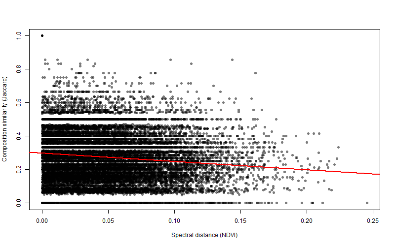
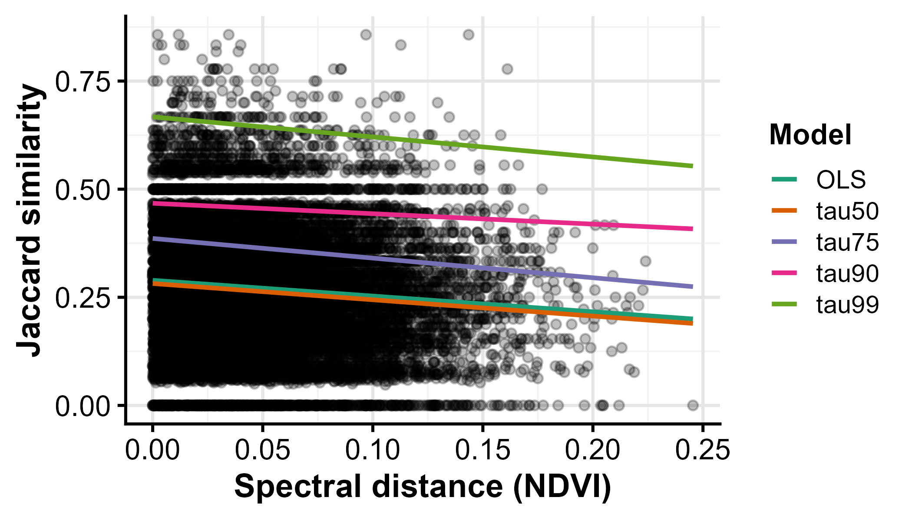
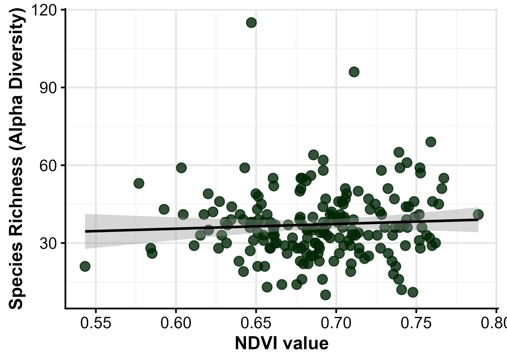
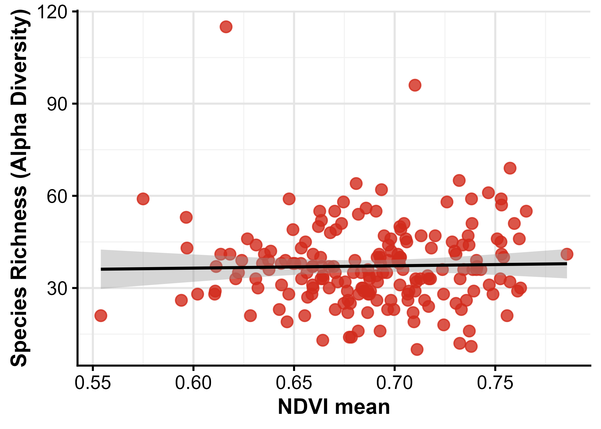
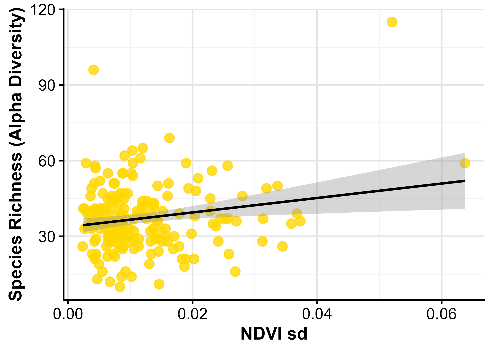
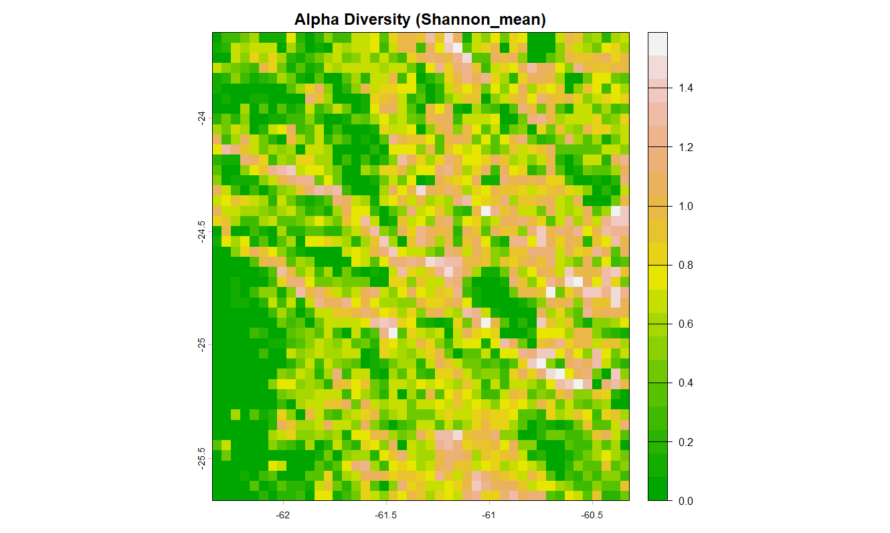
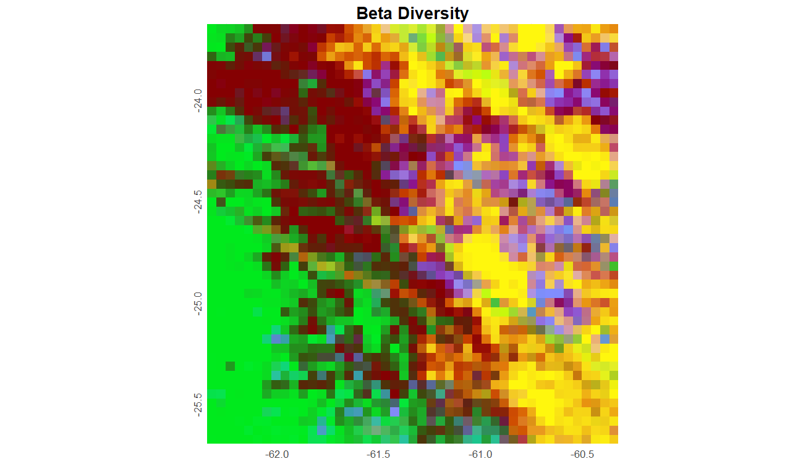
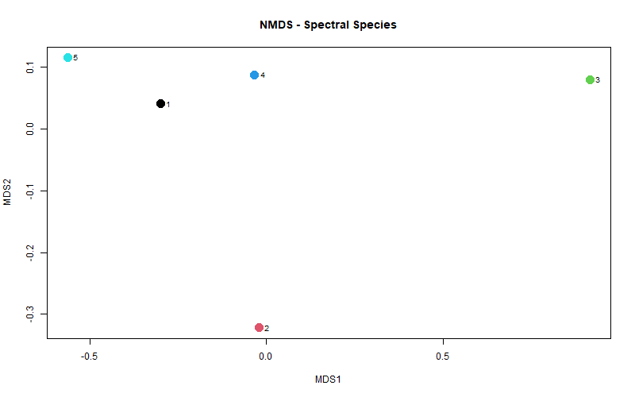

# 🌿 Reproducible Examples: Spectral–Biodiversity Analysis & biodivMapR

This folder contains two minimal reproducible examples for R-based spectral-biodiversity analyses:

1. **`spectral_diversity_analysis()`** – evaluates the relationship between species compositional similarity and spectral distance derived from NDVI, and produces plots relating species richness to NDVI metrics.
2. **`biodivMapR_full()`** – calculates alpha and beta diversity metrics from NDVI raster stacks using clustering and window-based approaches.

---
```markdown
> ⚠️ Important: To run these examples correctly, you must **clone the full repository**,  
> as the scripts depend on the folder structure and input data provided.
```
---

## 📁 Contents

```
examples/
 ├── 📁 input_data/
 │   ├── 📄 Community_matrix.csv        # Community matrix: sites in rows, species in columns, presence/absence values.
 │   ├── 📄 Sampling_points.csv         # Required columns: ID, long, lat, species richness.
 │   ├── 📄 Modis_2017_anualmedian.tif  # Annual NDVI raster required to compute spectral distances among sampling sites (2017-2020).
 │   └── 📄 stack_ndvi_2025.tif         # Monthly NDVI raster stack (12 bands, one per month) representing the annual NDVI time series.
 │
 ├── 📄 run_spectral_diversity_analysis.R    # Script to run the spectral_biodiversity_analysis workflow.
 ├── 📄 run_biodivMapR.R                        # Script to run the biodivMapR_full workflow.
 │
 ├── 📁 out/                            # Output folder where results generated by the scripts will be saved.
 └── 📁 Results/                        # Reference results produced with the example data, allowing users to compare their outputs results.
```

---

## 1️⃣ Spectral–Biodiversity Analysis ("run_spectral_diversity_analysis.R")

### 🛠️ Install Required Libraries
```r
#--------------------------------------------------------
# Install required packages
install.packages(c("vegan", "terra", "quantreg", "ggplot2", "dplyr", "rstudioapi"))
#--------------------------------------------------------

# Load libraries
library(vegan)
library(terra)
library(quantreg)
library(ggplot2)
library(dplyr)
library(rstudioapi)

setwd(dirname(rstudioapi::getActiveDocumentContext()$path)) # set working directory
```

### Theme
```r
theme_paper <- function(base_size = 18){
  theme_classic(base_size = base_size) +
    theme(panel.grid.major = element_line(color = "grey90"),
      panel.grid.minor = element_line(color = "grey95"),
      
      axis.title = element_text(face = "bold", size = 18),
      axis.text = element_text( color = "black",size = 16),
      axis.line = element_line( colour = "black", linewidth = 0.8),
      axis.ticks = element_line(colour = "black", linewidth = 0.8),
      legend.title = element_text(face = "bold", size = 16 ),
      legend.text = element_text( size = 14),
      plot.title = element_text(face = "bold", hjust = 0.5, size = 18)
    )
}
```

### ⚙️ Function
```r
spectral_diversity_analysis <- function(
    community_matrix_path,
    points_path,
    raster_paths,
    output_dir = "out",
    
    id_column = "ID",
    lon_column = "long",
    lat_column = "lat",
    year_column = "YEAR",
    richness_column = "richness",
    
    plot_alpha = TRUE,
    mantel_test = TRUE,
    quantile_regression = TRUE
) {
  
  dir.create(output_dir, showWarnings = FALSE,recursive = TRUE)
  
  
  
  #-------------------------------
  # 1. COMMUNITY MATRIX → JACCARD DISTANCE
  #-------------------------------
  community_matrix <- read.csv(community_matrix_path)
  points <- read.csv(points_path)
  
  community_matrix[[id_column]] <- as.character(
    community_matrix[[id_column]])
  
  points[[id_column]] <- as.character(points[[id_column]])
  points[[year_column]] <- as.character(points[[year_column]])
  
  
  rownames(community_matrix) <-community_matrix[[id_column]]
  species_only <- community_matrix[, names(community_matrix) != id_column,
    drop = FALSE]
  
  
  dist_jaccard <- vegdist(species_only, method = "jaccard", binary = TRUE)
  dist_jaccard_matrix <- as.matrix(dist_jaccard)
  
  
  write.csv(dist_jaccard_matrix, 
            file.path(output_dir,"distance_jaccard_matrix.csv"),row.names = TRUE)
  
  
  
  #-------------------------------
  # 2. EXTRACT NDVI 
  #-------------------------------
  ndvi_points_list <- list()
  for(year_i in unique(points[[year_column]])) {
    message("Processing year: ", year_i)
    
    points_year <- points[
      points[[year_column]] == year_i,
      , drop = FALSE]
    
    modis_raster <- rast(raster_paths[[year_i]])
    message("Raster bands: ",paste(names(modis_raster), collapse = ", "))
    
    ndvi_raster <- modis_raster[["NDVI"]]
    points_vect <- vect(
      points_year,
      geom = c(lon_column, lat_column),
      crs = "EPSG:4326")
    
    points_vect <- project(
      points_vect, crs(ndvi_raster))
    
    ndvi_mean3x3 <- focal(ndvi_raster, w = 3, fun = mean, na.rm = TRUE)
    ndvi_sd3x3   <- focal(ndvi_raster, w = 3, fun = sd, na.rm = TRUE)
    
    
    # Save extracted values
    ndvi_points_list[[year_i]] <- data.frame(
        ID = as.character(points_year[[id_column]]),
        year = year_i,
        ndvi = extract(ndvi_raster, points_vect)[[2]],
        mean_3x3 = extract(ndvi_mean3x3, points_vect)[[2]],
        sd_3x3 = extract(ndvi_sd3x3, points_vect)[[2]],
        stringsAsFactors = FALSE)
    
    
    # Free memory
      rm(modis_raster,
         ndvi_raster,
         ndvi_mean3x3,
         ndvi_sd3x3,
         points_vect
      )
    gc()
  }
  
  
  # JOIN ALL YEARS
  cat("\nJOINING YEARS\n")
    ndvi_points <- bind_rows(ndvi_points_list)
  
  cat("Total extracted plots:",nrow(ndvi_points),"\n")
  
  # Save extracted NDVI table
  write.csv(ndvi_points, 
            file.path(output_dir, "NDVI_extracted_by_plot.csv"),row.names = FALSE)
  
  # Remove plots without NDVI
  ndvi_points <- ndvi_points[!is.na(ndvi_points$ndvi),
      ,  drop = FALSE]
  
  
  # MATCH IDS
  ndvi_points$ID <- as.character(ndvi_points$ID)
  common_ids <- intersect(community_matrix[[id_column]], ndvi_points$ID)
  
  cat("Plots in community matrix:", nrow(community_matrix),"\n")
  cat("Plots with NDVI:", nrow(ndvi_points),"\n")
  cat("Plots used in analysis:", length(common_ids), "\n")
  
  
  # Order community matrix
  community_matrix <- community_matrix[
      match(common_ids,community_matrix[[id_column]]),
      , drop = FALSE]
  
  
  # Order NDVI table
  ndvi_points <- ndvi_points[
      match(common_ids,ndvi_points$ID),
      , drop = FALSE ]
  
  
  # Order geographic points exactly the same
   points_geo <- points[
        match(common_ids, points[[id_column]]),
        , drop = FALSE]
  
  
  
  #-------------------------------
  # 3. SPECTRAL DISTANCE FROM RASTER
  #-------------------------------
     ndvi_matrix <- ndvi_points[,"ndvi", drop = FALSE]
     rownames(ndvi_matrix) <- ndvi_points$ID
  
     dist_spectral <- as.matrix(dist(ndvi_matrix, method = "euclidean"))
  
       rownames(dist_spectral) <- ndvi_points$ID
       colnames(dist_spectral) <- ndvi_points$ID
  
     write.csv(dist_spectral, 
               file.path( output_dir, "spectral_distance_matrix.csv"), row.names = TRUE)
  
  
     # GEOGRAPHIC DISTANCE
     coords <- cbind( as.numeric(points_geo[[lon_column]]),
           as.numeric(points_geo[[lat_column]]))
  
     colnames(coords) <- c( "longitude","latitude")
     rownames(coords) <-points_geo[[id_column]]
  
  
     # Geographic distance in meters
     dist_geo_matrix <- geosphere::distm(
         coords,fun = geosphere::distHaversine)
  
  
     # Convert meters to kilometers
     dist_geo_matrix <- dist_geo_matrix / 1000
     rownames(dist_geo_matrix) <- points_geo[[id_column]]
     colnames(dist_geo_matrix) <- points_geo[[id_column]]
  
     write.csv(dist_geo_matrix, 
               file.path(output_dir, "geographic_distance_matrix_km.csv"), row.names = TRUE)
  
    
  #-------------------------------
  # 4. DISTANCE RELATIONSHIP PLOT
  #-------------------------------
  S_biodiv <- 1 - dist_jaccard_matrix
  
  png(file.path(output_dir, "distance_relationship_plot.png"),width = 800,height = 500)
  
  plot(as.numeric(dist_spectral), as.numeric(S_biodiv),
    xlab = "Spectral distance (NDVI)",
    ylab = "Composition similarity (Jaccard)",
    pch = 16,
    col = rgb(0,0,0,0.3))
  
  abline(lm(as.numeric(S_biodiv) ~as.numeric(dist_spectral)),
    col = "red",lwd = 2)
  
  dev.off()
  
  
  
  #-------------------------------
  # 5. MANTEL TESTS
  #-------------------------------
  if(mantel_test){
    
    cat("\n")
    cat("MANTEL ANALYSES\n")
    cat("=====================================\n")
    
    
    # A. SIMPLE MANTEL
    # Taxonomic dissimilarity vs spectral distance
    mantel_spectral <- mantel(
      as.dist(dist_jaccard_matrix),
      as.dist(dist_spectral),
      method = "pearson", permutations = 9999)
    
    
    # B. TAXONOMIC vs GEOGRAPHIC
    mantel_tax_geo <- mantel(
      as.dist(dist_jaccard_matrix),
      as.dist(dist_geo_matrix),
      method = "pearson", permutations = 9999)
    
    
    # C. SPECTRAL vs GEOGRAPHIC
    mantel_spec_geo <- mantel(
      as.dist(dist_spectral),
      as.dist(dist_geo_matrix),
      method = "pearson", permutations = 9999)
    
    
    # D. PARTIAL MANTEL
    # Taxonomic vs spectral controlling geographic distance
    mantel_partial <- mantel.partial(
      as.dist(dist_jaccard_matrix),
      as.dist(dist_spectral),
      as.dist(dist_geo_matrix),
      method = "pearson", permutations = 9999)
    
    
    # Save complete results
    cat("\n")
    cat("MANTEL AND PARTIAL MANTEL RESULTS\n")
    cat("=================================================\n\n")
    
    capture.output(
      {
        cat("MANTEL AND PARTIAL MANTEL RESULTS\n")
        cat("=================================================\n\n")
        
        cat("1. TAXONOMIC DISSIMILARITY vs SPECTRAL DISTANCE\n\n")
        print(mantel_spectral)
        
        cat("2. TAXONOMIC DISSIMILARITY vs GEOGRAPHIC DISTANCE\n\n")
        print(mantel_tax_geo)
        
        cat("3. SPECTRAL DISTANCE vs GEOGRAPHIC DISTANCE\n\n")
        print(mantel_spec_geo)
        
        cat("4. PARTIAL MANTEL\n")
        cat("Taxonomic dissimilarity vs spectral distance\n")
        cat("CONTROLLING FOR geographic distance\n\n")
        print(mantel_partial)
        
      },
      
    file = file.path(output_dir,"mantel_and_partial_mantel_results.txt"))
   }
  
  
  #-------------------------------
  # 6. OLS + QUANTILE REGRESSION
  #-------------------------------
  if(quantile_regression){
   df <- data.frame(
      dist_spec = as.vector(dist_spectral[upper.tri(dist_spectral)]),
      sim_bio = 1 - as.vector( dist_jaccard_matrix[ upper.tri(dist_jaccard_matrix)])
    )
    
    
    df <- na.omit(df)
    
    models <- list(
      OLS = lm(sim_bio ~ dist_spec, data = df),
      tau50 = rq(sim_bio ~ dist_spec,   tau = 0.5,data = df),
      tau75 = rq(sim_bio ~ dist_spec, tau = 0.75, data = df),
      tau90 = rq( sim_bio ~ dist_spec, tau = 0.9, data = df ),
      tau99 =  rq(sim_bio ~ dist_spec, tau = 0.99, data = df )
    )
    
    capture.output(lapply(models,summary),
      file = file.path(output_dir,"quantile_regression_results.txt"))
    
    
  # Predictions
    newdata <- data.frame(
      
    dist_spec = seq(min(df$dist_spec),
        max(df$dist_spec),length.out = 200))
    
    pred_df <- bind_rows(lapply(names(models),
        function(name){data.frame(
            dist_spec = newdata$dist_spec,
            sim_bio = predict(models[[name]], newdata), model = name)
        }
      )
    )
    
    
    # Plot
    p_quant <- ggplot(df, aes(x = dist_spec,y = sim_bio)) +
      
      geom_point( alpha = 0.25, size = 2, color = "black") +
      geom_line(data = pred_df, aes(color = model),linewidth = 1.2) +
      scale_color_brewer(palette = "Dark2") +
      labs(x = "Spectral distance (NDVI)",
        y = "Jaccard similarity", color = "Model") +
      coord_cartesian(xlim = c(0, NA),ylim = c(0, NA)) +
      theme_paper()
    
    
    ggsave(file.path(output_dir,"quantile_regression_plot_ggplot.png"),
      plot = p_quant, width = 7,height = 4,dpi = 300)
  }
  
  
  
  #-------------------------------
  # 7. ALPHA SPECTRAL VS ALPHA SPECIES
  #-------------------------------
  if(plot_alpha){
    data_plot <- left_join(points,ndvi_points,
      by = setNames("ID", id_column))
    
    vars <- c("ndvi", "sd_3x3", "mean_3x3")
    colors <- c("#002504","#ffd700", "#d22a1b")
    xlabels <- c("NDVI value","NDVI sd","NDVI mean" )
    
    results_alpha <- data.frame(
      variable = character(),
      R2 = numeric(),
      beta = numeric(),
      p_value = numeric())
    
    for(i in seq_along(vars)){
      formula <- as.formula(paste(richness_column,"~",vars[i] ))
      
      model <- lm(formula,data = data_plot)
      s <- summary(model)
      
      r2 <- s$r.squared
      beta <- s$coefficients[2,1]
      pval <- s$coefficients[2,4]
      
      results_alpha <- rbind( results_alpha,
        data.frame(variable = vars[i],
          R2 = r2,beta = beta, p_value = pval))
      
      
      p <- ggplot(data_plot, aes_string(x = vars[i], y = richness_column)) +
        geom_point(size = 4,alpha = 0.8,color = colors[i] ) +
        geom_smooth(method = "lm",formula = y ~ x,se = TRUE,color = "black",linewidth = 1.2 ) +
        labs(x = xlabels[i],y = "Species Richness (Alpha Diversity)") +
        theme_paper()
      
      
      ggsave(file.path(output_dir,  paste0("alpha_vs_",vars[i],".png") ),
        plot = p,  width = 7, height = 5,  dpi = 300)
    }
    
    write.csv(results_alpha,
              file.path(output_dir,"alpha_diversity_regression_results.csv"), row.names = FALSE )
 }
  
  # END
  return(paste("Analysis completed. Outputs saved in:",output_dir) )
}

```


### ▶️ Run the example
```r
#Aplications
raster_paths <- c(
  "2017" = "./input_data/Modis_2017_anualmedian.tif",
  "2018" = "./input_data/Modis_2018_anualmedian.tif",
  "2019" = "./input_data/Modis_2019_anualmedian.tif",
  "2020" = "./input_data/Modis_2020_anualmedian.tif.tif"
  )

spectral_diversity_analysis(
  community_matrix_path = "./input_data/Community_matrix.csv",
  points_path ="./input_data/sampling_points.csv",
  raster_paths =raster_paths,
  output_dir =  "./out",
  mantel_test = TRUE,
  quantile_regression = TRUE,
  plot_alpha = TRUE,
  
    # USER SETTINGS
  # Modify only if your column names are different
  id_column = "ID",
  lon_column ="long",
  lat_column = "lat",
  year_column = "year",
  richness_column = "richness"
)
```


### 📝 Expected outputs

All outputs are saved in `out/`:

```
out/
 ├── 📄 distance_jaccard_matrix.csv        # Pairwise Jaccard distance matrix calculated from the community matrix
 ├── 📄 spectral_distance_matrix.csv       # Pairwise spectral distance matrix derived from NDVI values at sampling points
 ├── 📄 distance_relationship_plot.png     # Scatter plot showing the relationship between species and spectral distances
 ├── 📄 mantel_test_results.txt            # Results of the Mantel test evaluating the correlation between both distance matrices
 ├── 📄 quantile_regression_results.txt    # Output summary of the quantile regression analysis
 ├── 📄 quantile_regression_plot.png       # Plot of the quantile regression showing the upper-bound relationship between distances
 ├── 📄 alpha_vs_ndvi.png                  # Scatter plot of species richness (number of species per plot). vs. NDVI values at sampling points
 ├── 📄 alpha_vs_mean_3x3.png              # Scatter plot of species richness (number of species per plot). vs. local 3x3 mean NDVI
 └── 📄 alpha_vs_sd_3x3.png                # Scatter plot of species richness (number of species per plot). vs. local 3x3 NDVI standard deviation

```

### 📝 Visualization of results

### β-Diversity → Spectral Similarity
The first plot shows the relationship between spectral distance and species composition similarity between plots.  
The second plot displays the quantile regressions (50th, 75th, 90th, and 99th percentiles) together with the OLS regression line.

<p align="center">
  
  
</p


### <h3>α-Diversity &rarr; Richness vs NDVI</h3>
These three plots show the relationship between species richness and different NDVI-based spectral metrics. Specifically, they show the relationship between species richness and (i) the NDVI values extracted at the sampling points, (ii) the mean NDVI calculated within a 3×3 moving window, and (iii) the standard deviation of NDVI calculated within a 3×3 moving window.

<p align="center">
    
    
    
 
</p>

---


## 2️⃣ Biodiversity Mapping with `biodivMapR_full()` ("run_BiodivMapR.R")

### 🛠️ Install Required Libraries
```r
##----------------------------------------------------------
## Download tools compatible with R 4.5
# Check that the system finds the required paths
Sys.which("make")
Sys.which("gcc")

## This confirms that R can compile packages from source.
install.packages("pkgbuild")
pkgbuild::check_build_tools(debug = TRUE)

# Installation
install.packages("remotes")
remotes::install_github("cran/dissUtils")
remotes::install_github("jbferet/biodivMapR")
install.packages(c("vegan", "terra", "ggplot2", "rstudioapi"))
##----------------------------------------------------------

# Load libraries
library(terra)       
library(biodivMapR)
library(ggplot2)
library(vegan) 

setwd(dirname(rstudioapi::getActiveDocumentContext()$path)) #set actual wd
```

### ⚙️ Function
```r
# Define file paths
ndvi_stack_path <- "./input_data/stack_ndvi_2025.tif"
# Optional vegetation mask
# mask_path <- "~/vegetation_mask.tif"
output_dir <- "./out/biodivMapR"
dir.create(output_dir, showWarnings = FALSE, recursive = TRUE)


# Read NDVI stack and split into single-band rasters
ndvi_stack <- rast(ndvi_stack_path)
ndvi_list <- lapply(1:nlyr(ndvi_stack), function(i){
  band_path <- file.path(output_dir, paste0("NDVI_band_", i, ".tif"))
  writeRaster(ndvi_stack[[i]], band_path, overwrite = TRUE)
  return(band_path)
})


# Create "all valid" mask
mask_all <- ndvi_stack[[1]]  # use first band as template
mask_all[] <- 1              # set all pixels as valid
mask_path_all <- file.path(output_dir, "mask_all.tif")
writeRaster(mask_all, mask_path_all, overwrite = TRUE)

# Define intermediate files
Kmeans_info_save <- file.path(output_dir,'Kmeans_info.RData')
Beta_info_save   <- file.path(output_dir,'Beta_info.RData')

# Run biodivMapR_full
set.seed(123)        # Set random seed to ensure reproducible results for K-means and Beta raster
window_size <- 10    # window size for diversity calculation
opts <- list(
  alpha_metrics    = c("richness","shannon","simpson"), # alpha diversity metrics
  Hill_order       = 1,
  nb_samples_alpha = NULL,                 # Number of pixels sampled to compute alpha diversity (across the whole image)
  nb_samples_beta  = NULL,                 # Number of pixels sampled to compute beta diversity (across the whole image)
  fd_metrics       = NULL,                 # functional diversity (NULL = not used)
  nb_clusters      = 5,                    # number of clusters
  nb_iter          = 3,                    # number of iterations
  pcelim           = 0.02,                 # percentile elimination
  maxRows          = 1e6,                  # Maximum number of pixels used to train K-means clustering (memory management)
  min_sun          = 0.0,                  # Minimum solar illumination threshold (0 = no filtering)
  progressbar      = TRUE                  # Show progress bar during computation
)
```

### ⚙️ Main parameters

- `window_size = 10` → size of the moving window for diversity calculations  
- `alpha_metrics = c("richness","shannon","simpson")`  
- `nb_clusters = 5` → number of clusters for K-means  
- `maxRows = 1e6` → memory management  
- `progressbar = TRUE` → shows computation progress

### ▶️ Run the example

```r
ab_info_NDVI <- biodivMapR_full(
  input_raster_path = ndvi_list,
  input_mask_path   = mask_path_all,
  output_dir        = output_dir,
  window_size       = window_size,
  Kmeans_info_save  = Kmeans_info_save,
  Beta_info_save    = Beta_info_save,
  options           = opts
)
```

### 📝 Visualization of results

```r
# Load rasters
shannon_raster <- rast(file.path(output_dir, "shannon_mean.tiff"))
beta_raster    <- rast(file.path(output_dir, "Beta.tiff"))  # must have 3 bands for RGB
```

### Alpha Spectral Diversity
```r
# Plot Alpha - Shannon
plot(shannon_raster,
     main = "Alpha Diversity (Shannon_mean)",
     col = terrain.colors(20))  # you can change the palette
```
<p align="center">
  
</p>

### Beta Spectral Diversity
```r
# Plot Beta diversity
# Convert SpatRaster to data frame
df <- as.data.frame(beta_raster, xy = TRUE)
colnames(df) <- c("x","y","R","G","B")

# Normalize values between 0 and 1
df$R <- (df$R - min(df$R, na.rm=TRUE)) / (max(df$R, na.rm=TRUE) - min(df$R, na.rm=TRUE))
df$G <- (df$G - min(df$G, na.rm=TRUE)) / (max(df$G, na.rm=TRUE) - min(df$G, na.rm=TRUE))
df$B <- (df$B - min(df$B, na.rm=TRUE)) / (max(df$B, na.rm=TRUE) - min(df$B, na.rm=TRUE))

# Create hexadecimal color
df$color <- rgb(df$R, df$G, df$B)

# Plot with ggplot
ggplot(df, aes(x = x, y = y, fill = color)) +
  geom_raster() +
  scale_fill_identity() +
  coord_equal() +
  labs(title = "Beta Diversity") +   
  scale_y_continuous(expand = c(0,0)) +
  scale_x_continuous(expand = c(0,0)) +
  theme_minimal() +
  theme(
    plot.title = element_text(
      size = 16, 
      hjust = 0.5, 
      face = "bold",
      margin = margin(b = 2)    
    ),
    axis.title = element_blank(),     # no axis labels
    axis.text.x = element_text(size = 10, angle = 0, vjust = 0.5),      
    axis.text.y = element_text(size = 10, angle = 90, hjust = 0.5)     
  )
```

<p align="center">
  
</p>


### ▶️ Run the example K-means clustering
```r
# Load Kmeans_info file
load(Kmeans_info_save)
centroids <- Kmeans_info$Centroids[[1]]   # first iteration

# Perform NMDS on centroids
nmds <- metaMDS(centroids, distance = "euclidean", k = 2)

# Save NMDS plot as PNG
png(filename = "./out/biodivMapR/nmds_plot.png", width = 800, height = 500)
plot(nmds$points,
     col = 1:nrow(centroids),
     pch = 19,
     cex = 2,
     main = "NMDS - Spectral Species")
text(nmds$points,
     labels = 1:nrow(centroids),
     pos = 4,
     cex = 0.8)
dev.off()
```
### 📝 Visualization of results

```r
load(Kmeans_info_save)

pts <- metaMDS(Kmeans_info$Centroids[[1]],
               distance = "euclidean", k = 2, trace = 0)$points

plot(pts,
     pch = 19,
     col = 1:nrow(pts),
     asp = 1,
     main = "NMDS - Spectral Species")

text(pts, labels = 1:nrow(pts), pos = 4, cex = 0.7)

```

<p align="center">
  
</p>


The NMDS plot displays the spectral species centroids obtained from the K-means clustering, allowing visualization of the spectral relationships among clusters in a two-dimensional space.

### 📝 Expected outputs

All outputs are saved in `out/`:

```
out/BiodivMapR
 ├── 📄 NDVI_band_*.tif        # Individual raster bands
 ├── 📄 mask_all.tif           # Mask used for analysis
 ├── 📄 Kmeans_info.RData      # Centroids and clustering info
 ├── 📄 Beta_info.RData        # Beta diversity results
 ├── 📄 nmds_plot.png          # NMDS of spectral species centroids (generated in R)
 ├── 📄 Beta                   # Beta diversity raster outputs
 ├── 📄 Shannon_*              # Shannon diversity raster outputs (two rasters: mean and standard deviation)
 ├── 📄 Simpson_*              # Simpson diversity raster outputs (two rasters: mean and standard deviation)
 └── 📄 richness_*             # Spectral richness raster outputs (two rasters: mean and standard deviation)
 ```

---

## ⚠️ Notes

- Both examples are fully reproducible  
- `out/` folder is created automatically if it does not exist  
- Adjust file paths in the scripts according to your local system before running

